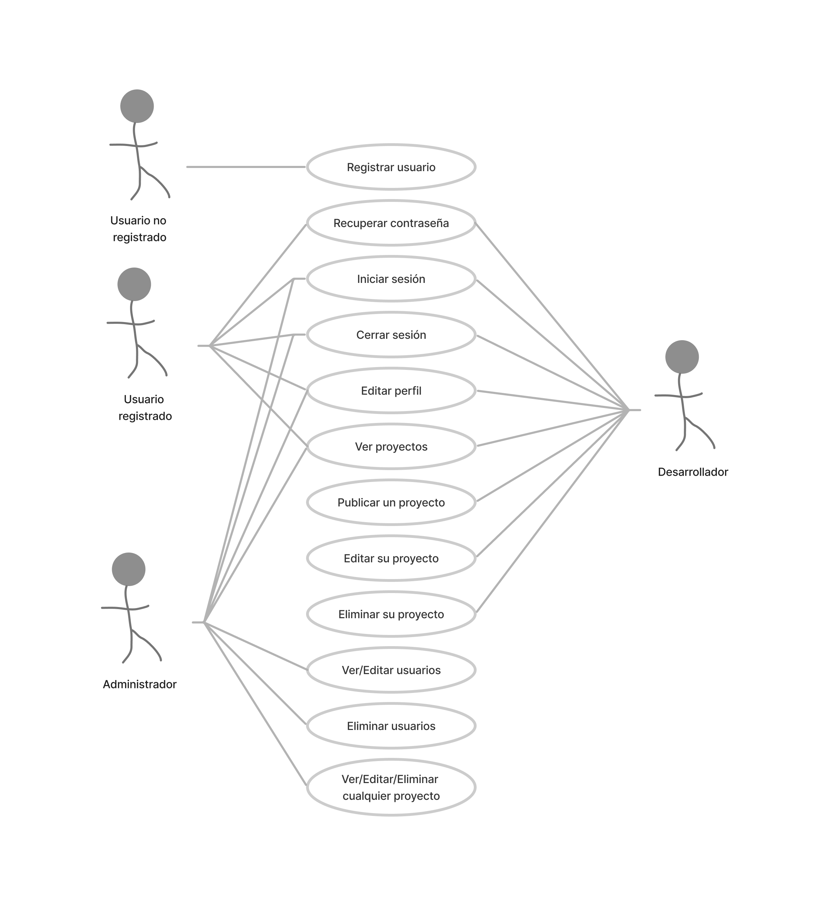

# Documentación
## Escenario del proyecto
**Vanilla Games S.L** es una empresa de desarrollo de minijuegos para navegadores web, creados con vanillaJS, es decir, desarrollados exclusivamente con Javascript como lenguaje de programación (sin frameworks)

En esta empresa trabajan 10 desarrolladores y, habitualmente, suelen tener a tres alumnos/as en prácticas, de los cuales, al menos uno, tendrá muchas posibilidades de formar parte del equipo de desarrollo al acabar su etapa de formación.

El método de trabajo que se utiliza en dicha empresa consiste en proponer a cada uno de los miembros del equipo el desarrollo de un minijuego que, al acabar, deberán compartir con el resto de sus compañeros. Estos, a su vez, deben comentar y valorar cada una de las propuestas. Finalmente, en la empresa hay un equipo responsable de seleccionar aquellas propuestas que muestran un mayor potencial, para ser desarrolladas de manera definitiva por todo el equipo de trabajo, con el fin de crear una aplicación para su posterior comercialización.

Hasta la fecha, para el proceso de publicación de proyectos, comentarios y valoración utilizaban algunas herramientas ofimáticas, tipo hoja de cálculo de google. Actualmente pretenden crear una aplicación web tipo intranet para llevar a cabo este propósito.

Como alumno en prácticas, tu trabajo consiste en crear una aplicación web que permitirá a los desarrolladores de Vanilla Games, publicar sus propuestas de minijuegos, de manera que el resto de compañeros podrá hacer comentarios y emitir una valoración de cada proyecto publicado en esta plataforma.

En la introducción de esta documentación, en la sección El proyecto Vanilla Games, en concreto en el apartado Requisitos del proyecto y casos de uso general, hemos definido qué se espera de nuestra aplicación web, a partir de los 'Casos de uso general'.

También hemos dividido todo el trabajo de desarrollo en diferentes versiones, con la intención de que nuestro proyecto esté operativo desde el inicio de su implementación, de manera que conforme evolucione a posteriores versiones, aumentaremos su nivel de funcionalidad.

Por lo tanto, vamos a comenzar por la versión 1.0.

Lo primero es definir los casos de uso para esta versión. Una primera aproximación podría ser la siguiente:

# Casos de uso para la V1.0
## Definición básica

- **Registrar usuario**: Un usuario puede registrarse en la plataforma proporcionando su nombre, apellidos, email y contraseña.
- **Recuperar contraseña**: Un usuario registrado puede solicitar la recuperación de su contraseña en caso de que la haya olvidado. Para ello, se le enviará un correo electrónico con las instrucciones para restablecer su contraseña.
- **Iniciar sesión**: Un usuario registrado puede iniciar sesión en la plataforma proporcionando su email y contraseña.
- **Cerrar sesión**: Un usuario puede cerrar su sesión en la plataforma en cualquier momento.
- **Editar perfil**: Un usuario registrado puede editar su perfil, actualizando su nombre, apellidos, email o contraseña.
- Ver proyectos: Un usuario registrado puede ver un listado de proyectos publicados por los desarrolladores.
- **Publicar proyecto**: Un usuario con el perfil de desarrollador puede publicar un proyecto proporcionando información como nombre, descripción, imagen representativa, enlaces a servidor de pruebas y repositorio de código, estado del proyecto, etc.
- **Editar proyecto**: Un usuario con el perfil de desarrollador puede editar un proyecto que haya publicado previamente, actualizando la información del proyecto.
- **Eliminar proyecto**: Un usuario con el perfil de desarrollador puede eliminar un proyecto que haya publicado previamente.
- **Ver/Editar usuarios**: Un adminsrador puede ver una tabla con todos los usuarios que hay registrados y editar la información, incluido el ROL de usuario.
- **Eliminar usuario**: Un administrador puede eliminar cualquier usuario registrado en la plataforma.

## Diagramas de casos de uso

## Casos de uso específicos y diagramas de flujo.
En el primer apartado 'Requisitos y diagrama de casos de uso' para esta versión 1.0, hemos definido de manera general los casos de uso que se contemplan para cada actor y los hemos reflejado en un diagrama de casos de uso.

Es el momento de ser más concretos y detenernos a reflexionar en cada uno de los procesos que se realizarán para cada tarea, incluyendo los posibles errores cometidos por el usuario o el propio sistema.

### Casos de uso específicos
1. **Registrar usuario**
- Actores: Usuario no registrado.
 
- Precondiciones: El usuario no ha iniciado sesión.

- Flujo básico:

  - El usuario navega a la página de registro.
  - El usuario introduce su nombre, apellidos, email y contraseña.
  - El sistema valida que los campos estén completos y que el email no esté registrado previamente.
  - El sistema crea un nuevo usuario con los datos proporcionados.
  - El sistema muestra un mensaje de confirmación y redirige al usuario a la página de inicio.
- Flujos alternativos:
  - 3a. El sistema detecta que el email ya está registrado: muestra un mensaje de error y no crea la cuenta.

2. **Recuperar contraseña**
- Actores: Usuario registrado.

- Precondiciones: El usuario no ha iniciado sesión.

- Flujo básico:

  - El usuario navega a la página de registro.
  - El usuario selecciona la opción 'Recuperar contraseña'
  - El sistema valida que el campo 'email' esté completo y que el email esté registrado previamente.
  - El sistema muestra un mensaje de confirmación de envio del mail para la recuperación de contraseña y redirige al usuario a la página de inicio.
- Flujos alternativos:
  - 3a. El sistema detecta que el email no está registrado: muestra un mensaje de error y no envia el mail.
3. **Iniciar sesión**
- Actores: Usuario registrado.

- Precondiciones: El usuario no ha iniciado sesión.

- Flujo básico:

  - El usuario navega a la página de inicio de sesión.
  - El usuario introduce su email y contraseña.
  - El sistema valida las credenciales y crea una sesión para el usuario.
  - El sistema redirige al usuario a la página principal de la aplicación.
- Flujos alternativos:
  - 3a. Las credenciales son incorrectas: el sistema muestra un mensaje de error y no crea la sesión.
4. **Cerrar sesión**
- Actores: Usuario registrado.

- Precondiciones: El usuario ha iniciado sesión.

- Flujo básico:

  - El usuario hace clic en el botón de "cerrar sesión".
  - El sistema cierra la sesión del usuario.
  - El sistema redirige al usuario a la página de inicio.
5. **Ver/Editar perfil**
- Actores: Usuario registrado.

- Precondiciones: El usuario ha iniciado sesión.

- Flujo básico:

  - El usuario navega a la página de edición de perfil.
  - El usuario edita su nombre, apellidos y contraseña.
  - El sistema valida los campos y actualiza el perfil del usuario
  - El sistema muestra un mensaje de confirmación.
- Flujos alternativos:
  - 3a. El usuario intenta cambiar su email: el sistema valida que el email no esté registrado previamente.
6. **Ver proyectos**
- Actores: Usuario registrado.

- Precondiciones: El usuario ha iniciado sesión.

- Flujo básico:

  - El usuario navega a la página de proyectos.
  - El sistema muestra una lista de proyectos publicados por desarrolladores
  - El usuario puede hacer clic en un proyecto para ver más detalles
  - El usuario puede mostrar/filtrar los proyectos a partir de un buscador
7. **Publicar proyecto**
- Actores: Usuario registrado con perfil de desarrollador.

- Precondiciones: El usuario ha iniciado sesión y su perfil es de desarrollador.

- Flujo básico:

  - El usuario navega a la página de publicación de proyecto.
  - El usuario introduce el nombre, descripción, imagen representativa, enlaces de servidor y repositorio, estado y otra información relevante del proyecto.
  - El sistema valida los campos y crea un nuevo proyecto.
  - El sistema muestra un mensaje de confirmación y redirige al usuario a la página de proyectos.
- Flujos alternativos:
  - 2a. El desarrollador decide no publicar el proyecto y selecciona la opción de cancelar.
  - El sistema descarta la información ingresada en el formulario.
  - El sistema muestra un mensaje de confirmación al desarrollador.
8. **Editar proyecto**
- Actor principal: Desarrollador

- Objetivo: Editar la información de un proyecto previamente creado.

- Precondiciones: El usuario debe haber iniciado sesión como desarrollador y tener al menos un proyecto previamente creado.

- Flujo principal:

  - El usuario selecciona la opción de "Editar proyecto".
  - El sistema muestra la lista de proyectos previamente creados por el usuario.
  - El usuario selecciona el proyecto que desea editar.
  - El sistema muestra el formulario de edición del proyecto con la información actual del mismo.
  - El usuario realiza los cambios necesarios en la información del proyecto y guarda los cambios.
  - El sistema valida la información ingresada por el usuario y actualiza la información del proyecto en la base de datos.
  - El sistema muestra una confirmación de que la información del proyecto ha sido actualizada correctamente.
9. **Eliminar proyecto**
- Actor principal: Desarrollador

- Objetivo: Eliminar un proyecto previamente creado.

- Precondiciones: El usuario debe haber iniciado sesión como desarrollador y tener al menos un proyecto previamente creado.

- Flujo principal:

  - El usuario selecciona la opción de "Eliminar proyecto" del proyecto que desea eliminar.
  - El sistema muestra una confirmación de que el usuario está seguro de eliminar el proyecto seleccionado.
  - El usuario confirma que desea eliminar el proyecto.
  - El sistema elimina el proyecto de la base de datos y muestra una confirmación de que el proyecto ha sido eliminado correctamente.
  - El sistema actualiza la información de proyectos.
10. **Ver/Editar usuario**
- Actor principal: Usuario administrador

- Objetivo: Editar la información de los usuarios registrados.

- Precondiciones: El usuario debe haber iniciado sesión en la aplicación y tener rol administrador.

- Flujo principal:

  - El usuario selecciona la opción de "Ver usuarios".
  - El sistema muestra una tabla con 'inputs' con los datos de los usuarios.
  - El administrador realiza los cambios necesarios en la información de los usuarios (incluido el rol y el estado) y guarda los cambios.
  - El sistema valida la información ingresada por el usuario y actualiza la información del usuario en la base de datos.
  - El sistema muestra una confirmación de que la información del perfil ha sido actualizada correctamente.
  
11. **Eliminar usuario**
Actor principal: Usuario administrador

- Objetivo: Eliminar usuario del sistema.

- Precondiciones: El usuario debe haber iniciado sesión en la aplicación y debe tener rol administrador.

- Flujo principal:

 - El usuario selecciona la opción de "Ver usuarios".
 - El sistema muestra una tabla con 'inputs' con los datos de los usuarios.
 -  El administrador hace clic sobre el icono de eliminar usuario de la fila correspondiente.
 -  El sistema informa de que se eliminarán todos sus registros.
 -  El sistema muestra una confirmación de que la información de que el usuario ha sido borrado correctamente.

### Errores
Vamos a repasar los diferentes casos de uso analizando el flujo principal y añadiendo los flujos alternativos para contemplar los posibles errores del sistema. Puedes considerar los siguientes mensajes:

**Error de conexión**: El servidor no puede establecer una conexión con la base de datos, lo que impide que se puedan realizar operaciones en la plataforma. El sistema debería mostrar un mensaje de error indicando que no se pudo conectar con la base de datos y ofrecer la posibilidad de volver a intentarlo o contactar con el soporte técnico.

**Error de validación**: Cuando el sistema recibe información del usuario, debe validarla para asegurarse de que cumple con los requisitos de formato y contenido necesarios. Si la información no es válida, el sistema debería mostrar un mensaje de error indicando el problema específico, como "El campo de correo electrónico debe ser una dirección de correo válida".

**Error de autenticación**: Si un usuario intenta acceder a una página o realizar una acción que requiere autenticación, pero no ha iniciado sesión o sus credenciales son incorrectas, el sistema debería mostrar un mensaje de error indicando que la acción no está autorizada y ofrecer la posibilidad de iniciar sesión o recuperar la contraseña.

**Error de autorización**: Si un usuario intenta realizar una acción que no está autorizada para realizar debido a su rol, el sistema debería mostrar un mensaje de error indicando que la acción no está autorizada y ofrecer la posibilidad de volver a la página anterior.

**Error de servidor**: En caso de que se produzca un error interno en el servidor, como una excepción no controlada, el sistema debería mostrar un mensaje de error genérico indicando que se produjo un error y ofrecer la posibilidad de volver a intentarlo o contactar con el soporte técnico.